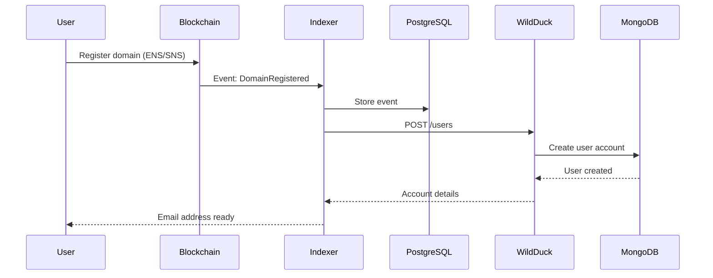
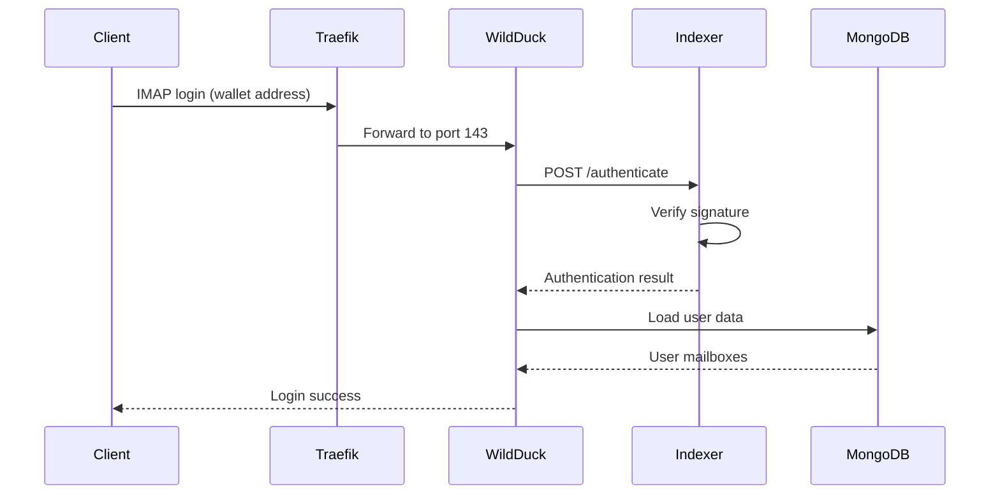
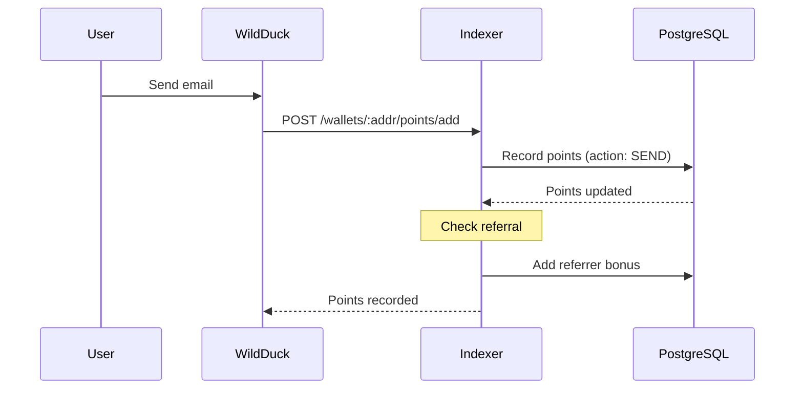

# WildDuck Dockerized - System Architecture

## High-Level Architecture

```
┌─────────────────────────────────────────────────────────────────┐
│                         Internet                                 │
└────────────────┬────────────────────────────────────────────────┘
                 │
                 ▼
┌─────────────────────────────────────────────────────────────────┐
│                    Traefik (Reverse Proxy)                      │
│  ┌──────────┬──────────┬──────────┬──────────┬──────────┐      │
│  │ HTTP:80  │HTTPS:443 │IMAPS:993 │POP3S:995 │SMTPS:465 │      │
│  └──────────┴──────────┴──────────┴──────────┴──────────┘      │
│  - Let's Encrypt SSL/TLS                                        │
│  - Path-based routing: /api → WildDuck, /idx → Indexer         │
│  - TLS termination for mail protocols                           │
└────────┬──────────┬──────────────────────────────────────────┬──┘
         │          │                                          │
         │          │                                          │
    ┌────▼────┐ ┌──▼──────────────┐              ┌───────────▼────┐
    │WildDuck │ │Mail Box Indexer │              │   Haraka :25   │
    │  :8080  │ │     :42069      │              │(Inbound SMTP)  │
    └────┬────┘ └──┬──────────────┘              └───────┬────────┘
         │         │                                      │
         │         │                                      │
    ┌────▼────┐ ┌──▼──────────────┐              ┌───────▼────────┐
    │ ZoneMTA │ │   PostgreSQL    │              │    Rspamd      │
    │  :587   │ │     :5432       │              │(Spam Filter)   │
    └────┬────┘ └─────────────────┘              └────────────────┘
         │
    ┌────▼──────────────────┐
    │      MongoDB          │
    │       :27017          │
    │  ┌──────────────────┐ │
    │  │Users & Mailboxes │ │
    │  │Messages          │ │
    │  │Filters & Rules   │ │
    │  └──────────────────┘ │
    └───────────┬───────────┘
                │
    ┌───────────▼───────────┐
    │       Redis           │
    │       :6379           │
    │  ┌──────────────────┐ │
    │  │Session Cache     │ │
    │  │Rate Limiting     │ │
    │  │Queue Management  │ │
    │  └──────────────────┘ │
    └───────────────────────┘
```

## Service Communication Flow

### Email Reception (Inbound)

```
Internet → Port 25 → Haraka
                      │
                      ├─→ Rspamd (spam check)
                      │
                      ├─→ MongoDB (store message)
                      │
                      └─→ Redis (update counters)
```

### Email Sending (Outbound)

```
IMAP Client → Traefik:465 → WildDuck
                              │
                              ├─→ MongoDB (create draft)
                              │
                              └─→ ZoneMTA (queue for sending)
                                   │
                                   └─→ Internet
```

### API Requests

```
HTTP Client → Traefik:443/api → WildDuck API
                                  │
                                  ├─→ MongoDB (data operations)
                                  │
                                  └─→ Redis (sessions)

HTTP Client → Traefik:443/idx → Mail Box Indexer
                                  │
                                  ├─→ PostgreSQL (blockchain data)
                                  │
                                  ├─→ MongoDB (user lookup)
                                  │
                                  └─→ WildDuck API (create accounts)
```

### Blockchain Indexing

```
Blockchain Networks → Alchemy RPC → Mail Box Indexer (Ponder)
                                     │
                                     ├─→ PostgreSQL (index events)
                                     │
                                     ├─→ WildDuck API (create accounts)
                                     │
                                     └─→ Points System (track activity)
```

## Data Flow Diagrams

### User Account Creation (Blockchain)



### Email Authentication



### Points System



## Component Details

### WildDuck (IMAP/POP3/API Server)

**Technology**: Node.js, MongoDB driver, Restify
**Port**: 8080 (internal), exposed via Traefik
**Responsibilities**:
- IMAP/POP3 protocol handling
- User authentication (delegates to Indexer for wallet auth)
- Mailbox management
- Message storage and retrieval
- Filter/rule execution
- REST API for management

**Key Features**:
- Multi-user support
- Virtual mailboxes
- Server-side filtering
- Quota management
- 2FA support (TOTP, WebAuthn)
- Application-specific passwords

**Configuration**: TOML files in `config/wildduck/`
- `default.toml` - Main settings
- `dbs.toml` - Database connections
- `api.toml` - API configuration

### Mail Box Indexer (Blockchain Integration)

**Technology**: Node.js, Ponder (indexing framework), Hono (API)
**Port**: 42069 (internal), exposed via Traefik at `/idx`
**Responsibilities**:
- Index blockchain events (domain registration, delegation)
- Wallet-based authentication
- OAuth 2.0/OpenID Connect provider
- Points and referral system
- KYC integration (Sumsub)
- Account creation via WildDuck API

**Indexed Chains**:
- Ethereum Mainnet (ENS domains)
- Polygon (custom domains)
- Optimism (custom domains)
- Base (custom domains)
- Solana (SNS domains via Helius)

**Key Contracts Indexed**:
- ENS Registry & Resolver
- ENS Public Resolver
- Custom mail registry contracts
- Solana Name Service programs

**Configuration**: Environment variables in `.env`

### ZoneMTA (Outbound SMTP)

**Technology**: Node.js, SMTP server
**Port**: 587 (internal), 465 (via Traefik)
**Responsibilities**:
- Queue outbound emails
- Handle delivery retries
- DKIM signing
- Bounce handling
- Rate limiting

**Integration**: Connects to MongoDB for queue and WildDuck for user lookup

### Haraka (Inbound SMTP)

**Technology**: Node.js, SMTP server
**Port**: 25 (exposed directly)
**Responsibilities**:
- Receive incoming emails
- Spam filtering (via Rspamd)
- Virus scanning
- Greylisting
- Deliver to WildDuck

**Plugins**:
- `wildduck` - Integration plugin
- `rspamd` - Spam filtering
- `dkim_verify` - DKIM verification

### Rspamd (Spam Filter)

**Technology**: C, Redis
**Port**: Internal only
**Responsibilities**:
- Spam detection (Bayes, rules)
- DKIM/SPF/DMARC verification
- Greylisting
- Rate limiting
- Statistical analysis

**Configuration**: UCL files in `config/rspamd/`

### Traefik (Reverse Proxy)

**Technology**: Go
**Ports**: 80, 443, 993, 995, 465
**Responsibilities**:
- TLS termination
- Request routing
- Let's Encrypt automation
- Load balancing (if scaled)
- Path-based routing

**Routing Rules**:
- `Host(HOSTNAME) && PathPrefix(/api)` → WildDuck (strip `/api`)
- `Host(HOSTNAME) && PathPrefix(/idx)` → Indexer (strip `/idx`)
- `HostSNI(HOSTNAME)` on port 993 → WildDuck:143 (IMAPS)
- `HostSNI(HOSTNAME)` on port 995 → WildDuck:110 (POP3S)
- `HostSNI(HOSTNAME)` on port 465 → ZoneMTA:587 (SMTPS)

### MongoDB (Primary Database)

**Technology**: MongoDB 5.0+
**Port**: 27017 (internal)
**Databases**:
- `wildduck` - User accounts, mailboxes, messages
- `zonemta` - Queue, delivery status
- `haraka` - Temporary storage

**Collections** (wildduck):
- `users` - User accounts
- `addresses` - Email addresses
- `mailboxes` - Folder structure
- `messages` - Email messages
- `filters` - User-defined rules
- `asps` - Application passwords
- `authlog` - Authentication history

**Indexes**: Optimized for common queries (user lookups, message listing)

### PostgreSQL (Indexer Database)

**Technology**: PostgreSQL 15
**Port**: 5432 (localhost only)
**Schema**: `public`
**Tables** (managed by Ponder):
- Event logs (domain registrations, delegations)
- User points and referrals
- OAuth sessions and tokens
- KYC verification status

**Indexes**: Optimized for blockchain queries (by address, by chain)

### Redis (Cache & Sessions)

**Technology**: Redis 7.0+
**Port**: 6379 (internal)
**Databases**:
- DB 3: WildDuck sessions
- DB 5: ZoneMTA queue
- DB 8: Rate limiting
- Additional DBs for other services

**Usage**:
- Session storage
- Authentication rate limiting
- Message queue (ZoneMTA)
- Temporary data cache

## Network Architecture

### Docker Networks

All services run on the default Docker bridge network created by docker-compose:
- Network name: `wildduck-dockerized_default`
- Driver: bridge
- Internal DNS: Service names resolve to container IPs

### Service Discovery

Services communicate using Docker DNS:
- `mongo` → MongoDB container
- `redis` → Redis container
- `postgres` → PostgreSQL container
- `wildduck` → WildDuck container
- `mail_box_indexer` → Indexer container

### Port Mapping

**Exposed to Host**:
- 25 → Haraka (SMTP)
- 80 → Traefik (HTTP)
- 443 → Traefik (HTTPS)
- 993 → Traefik → WildDuck (IMAPS)
- 995 → Traefik → WildDuck (POP3S)
- 465 → Traefik → ZoneMTA (SMTPS)
- 5432 → PostgreSQL (localhost only)

**Internal Only** (not exposed):
- 8080 → WildDuck API
- 42069 → Mail Box Indexer
- 27017 → MongoDB
- 6379 → Redis
- 587 → ZoneMTA

## Security Architecture

### Authentication Layers

1. **Email Clients** (IMAP/POP3/SMTP):
   - Username/password (traditional)
   - Wallet signature (blockchain users)
   - Application-specific passwords
   - 2FA (TOTP, WebAuthn)

2. **API Access**:
   - WildDuck: `X-Access-Token` header
   - Indexer: Wallet signature verification
   - Indexer OAuth: Bearer tokens

3. **Internal Services**:
   - IP-based restrictions (WildDuck ↔ Indexer)
   - Shared secrets (configuration)

### TLS/SSL Strategy

1. **External Connections**:
   - Let's Encrypt certificates (Traefik)
   - Auto-renewal via ACME
   - TLS 1.2+ only

2. **Internal Connections**:
   - Plain HTTP (within Docker network)
   - Isolated from external access

3. **Email Protocols**:
   - STARTTLS disabled (SSL/TLS only)
   - Traefik handles TLS termination
   - Backend services use plain TCP

### Data Protection

1. **At Rest**:
   - MongoDB: File system encryption (optional)
   - PostgreSQL: Volume encryption (optional)
   - Passwords: bcrypt hashing

2. **In Transit**:
   - External: TLS 1.2+
   - Internal: Docker network isolation

3. **Secrets Management**:
   - Environment variables
   - Git-ignored `.env` file
   - No hardcoded credentials

## Scalability Considerations

### Current Architecture (Single Node)

All services run on one Docker host
- Suitable for: Small to medium deployments
- Max users: ~1000-10000 (depends on resources)
- Single point of failure

### Scaling Options

1. **Vertical Scaling**:
   - Increase Docker host resources
   - Adjust container limits
   - Easy, limited ceiling

2. **Horizontal Scaling** (requires architecture changes):
   - Multiple WildDuck instances (load balanced)
   - MongoDB replica set or sharding
   - Redis cluster
   - Separate Traefik instances
   - Geographic distribution

### Performance Optimization

1. **Database**:
   - MongoDB indexes (already optimized)
   - Connection pooling
   - Query optimization

2. **Caching**:
   - Redis for sessions and frequently accessed data
   - Rspamd statistical cache

3. **Resource Limits**:
   - Container CPU/memory limits (configure as needed)
   - Connection limits (SMTP, IMAP)

## Monitoring & Observability

### Health Checks

All services have Docker health checks:
- MongoDB: `mongosh --eval "db.adminCommand('ping')"`
- Redis: `redis-cli ping`
- WildDuck: `wget http://localhost:8080/health`
- Indexer: `wget http://localhost:42069/health`
- PostgreSQL: `pg_isready`

### Logging

1. **Container Logs**:
   - `docker-compose logs -f SERVICE`
   - JSON format (Docker driver)

2. **Application Logs**:
   - WildDuck: Configurable level (silly, debug, info, warn, error)
   - Indexer: Ponder logging system

3. **Monitoring Scripts**:
   - `monitor-containers.sh` - Real-time monitoring
   - `quick-diagnosis.sh` - Health checks

## Deployment Patterns

### Development

```
Developer Machine
├── docker-compose-alt-ports.yml
├── Self-signed certificates
├── Direct port access (no Traefik)
└── Local testing tools
```

### Production

```
VPS/Cloud Server
├── docker-compose.yml
├── Let's Encrypt certificates
├── Traefik routing
├── Firewall rules
└── Monitoring setup
```

### Split Deployment (Advanced)

```
Backend Server (Mail)          Frontend Server (Webmail - deprecated)
├── WildDuck                   ├── Webmail UI
├── Databases                  └── API proxy to backend
├── ZoneMTA
└── Haraka
```

## Disaster Recovery

### Backup Strategy

1. **MongoDB** (critical):
   - Daily: `mongodump`
   - Point-in-time: Replica set oplog
   - Backup: User accounts, mailboxes, messages

2. **PostgreSQL** (important):
   - Daily: `pg_dump`
   - Backup: Blockchain indexes (can be rebuilt)

3. **Configuration** (critical):
   - Version control: docker-compose.yml
   - Backup: `config-generated/` directory

4. **Certificates** (important):
   - Backup: `certs/` directory
   - Auto-renew: Let's Encrypt

### Recovery Procedures

1. **Service Failure**:
   - Docker restart policy: `unless-stopped`
   - Health checks trigger automatic restarts
   - Manual: `docker-compose restart SERVICE`

2. **Data Corruption**:
   - Restore from MongoDB backup
   - Rebuild PostgreSQL from blockchain (indexer)

3. **Complete Failure**:
   - Restore configuration
   - Restore database backups
   - Re-run setup scripts
   - Update DNS if needed

## Integration Points

### WildDuck ↔ Mail Box Indexer

**Authentication Flow**:
```
WildDuck → POST /idx/authenticate
         ← { success: true, user: {...} }
```

**Account Creation**:
```
Indexer → POST /api/users
        ← { success: true, id: "userId" }
```

**Points Tracking**:
```
WildDuck → POST /idx/wallets/:addr/points/add
         ← { points: 150 }
```

### External Integrations

1. **Alchemy** (RPC provider):
   - Purpose: Blockchain event indexing
   - Protocol: HTTPS/WSS

2. **Helius** (Solana):
   - Purpose: Solana transaction webhooks
   - Protocol: HTTPS webhooks

3. **Sumsub** (KYC):
   - Purpose: Identity verification
   - Protocol: HTTPS REST API

4. **RevenueCat** (Subscriptions):
   - Purpose: Entitlement management
   - Protocol: HTTPS REST API

## Technology Stack Summary

| Component | Technology | Language | Framework |
|-----------|-----------|----------|-----------|
| WildDuck | Node.js | JavaScript | Restify |
| Mail Box Indexer | Node.js | TypeScript | Ponder, Hono |
| ZoneMTA | Node.js | JavaScript | Custom |
| Haraka | Node.js | JavaScript | Haraka |
| Rspamd | C | C | Rspamd |
| Traefik | Binary | Go | Traefik |
| MongoDB | Database | C++ | MongoDB |
| PostgreSQL | Database | C | PostgreSQL |
| Redis | Cache | C | Redis |

## Future Architecture Considerations

1. **Microservices**: Currently semi-monolithic, could split further
2. **Kubernetes**: Container orchestration for multi-node
3. **Service Mesh**: Istio/Linkerd for advanced networking
4. **Event Streaming**: Kafka for event-driven architecture
5. **API Gateway**: Dedicated gateway vs. Traefik
6. **CDN**: Content delivery for static assets
7. **Geographic Distribution**: Multi-region deployment
